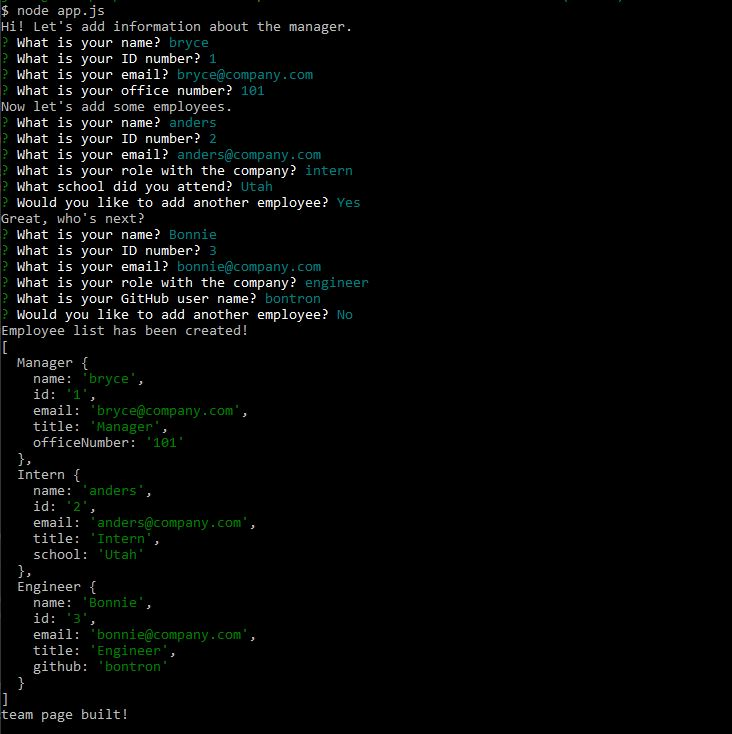
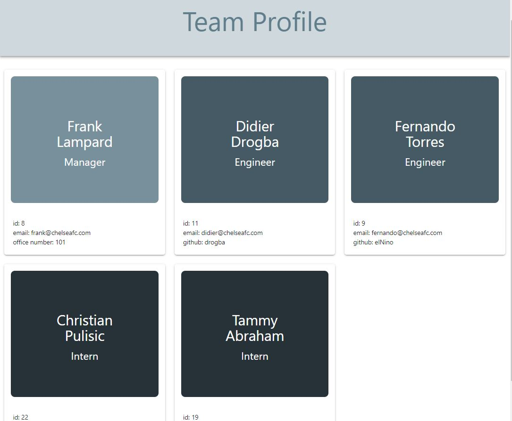
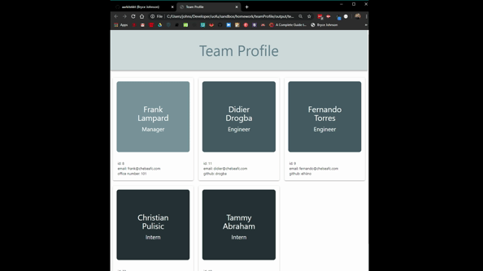

# Team Profile Builder

Repository: https://github.com/aarkitekkt/teamProfile

## Overview
​
The purpose of this application is to generate an html team profile page based on CLI user input providing information on team members. 
​
### Gallery
​
Prompts:

Deployed Page:

​
Responsive Design:

​
### Problem

The biggest challenge faced with this application was taking the array generated from the user inputs and appending that to an html file.  The difficulty came from have to generate different html depedning on the employee type and then dynmically append these cards to a main template page.

### Solution
​
My solution was to first create a generateCard function that would first check to see the type of employee of each object and then return a template literal specific to that employee type that used "${expression}" placeholders that could pull relevent information from the employees array. 

In the main html template, I used a map() and passed the generateCard function into that method to cycle through the employees array to generate each card for the employee.  

## Tech and Features Used
​
* Materialize CSS
* Javascript
* Jest npm
* Inquirer npm
* Node JS
​
## How to use
​
First use "node app.js" in the command line to open the file and then answer the prompts for the manager information. Then proceed to use the prompts to add information for as many employees as desired.  When no more employees are needed, the HTML file is created containing a card for each employee displaying the collected data.s 
​
## Technical Overview
​
1. A file "prompts.js" contains all of the user prompts for different employee types.
2. When "node app.js" is ran in the command line, a buildTeam function is initiated and runs a function to prompt the user about information for the manager and then the manager data is pushed to an employees array.
3. When the manager prompts finish, the employee prompt function runs ands asks the user questions about the first employee.
4. A prompt asks if the employee is either an "intern" or "engineer". Depending on the answer, a title specific question is asked after which the employee data is pushed to an employees array.
5. The next prompt asks if another employee is going to be added.  If the answer is yes, the promptEmployees function runs again.  If the answer is no, the writeHTML function is triggered and the html is generated for the team.
6. A generateHTML function returns a template literal for the main html content of the page with a ${placeholder} where the employee cards will be generated.
7. The placeholder contains a map method on the employees array generated from the prompts.  Passed through the map method is a generateCard function that checks the type of employee and returns the corresponding html for that employee type while grabbing the employee data to fill in the placeholders within the html template.
8. Finally, using fs-writefile, the complete html is written to a new file called 'team.html' which is saved in the output folder.
